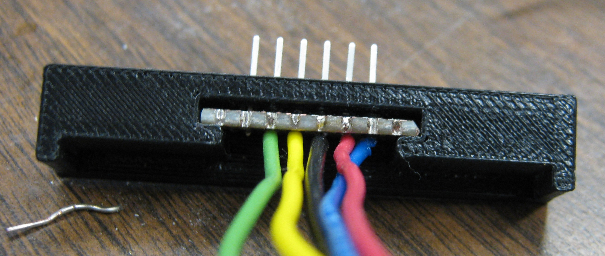

# PICkit2, PICkit3 Programming Header to Breadboard Bracket (Master Branch - Arms removed)

This version of the README.md file will be updated with new photos as they becom available.

## Purpose of the bracket-breadboard SCAD Project
In APSC1299 and PHYS1600 a six pin programming header must be attached to a solderless breadboard. In the past this has been done with hot glue as a quick simple solution. A better long term solution is desirable. The last time I needed a bracket I turned to having it 3D printed and was happy with the result. This project lends itself nicely to 3D printing because the bracket will be small with fine features.

Final Version (to reduce cost attachment arms were left out)

Image of prototype

## Creating a 3D Model using OpenSCAD

OpenSCAD is an free open source program that can be used for creating and viewing 3D models.

* [My notes on OpenSCAD including links](https://danpeirce.github.io/openscad.html)

### The Model

This image is from the second version of the SCAD file

These images are from the [first version of the SCAD file](https://github.com/danpeirce/bracket-breadboard/blob/c5ccfa7ed66dbcf597f41a93814c27feb3500029/bracket_programming.scad).

## Amended Procedure of adding Header and Wire

In 2016 the procedure for adding the header and wire was Amended to speed up the process.

In interest of keeping new programming header mounting method more time efficient and at the same time keeping 
the final result essentially unchanged I have worked out the following procedure/method (still using the existing 
3D printed part):

I then mount it with hotglue so it can be removed the next time the breadbaord needs to be replaced:

The other change that helps get this together faster than before is the addition of a small piece of proto board 
and the change to straight header pins:

* I solder the wires on first.
* Insert the header into the 3d printed addaptor.
* Then solder the header pins.

This way one can avoid twisting the wire onto each pin and crimping which is what I did before. 

## Prototype
 
These are the first images of the prototype that has been 3D printed in the KPU drafting department.
 

 

## Soldering Wire Onto the Programming Header

The end of the hookup wire was bent in a loop and crimped onto the pins below the bend of in each pin. Solder was applied.

Once the wire was cool the insulation was slipped down to insulate the wire up to the solder joint.

The header is inserted into the bracket from the back.

The end of the pins are snapped into place with a small flat screwdriver (they fit into a shallow narrow slot).

The bracket is twisted onto the board until it snaps in place.

The placement of the wire is adjusted.

The rest of the wires are placed into the grove, trimmed and stripped to complete connections.

